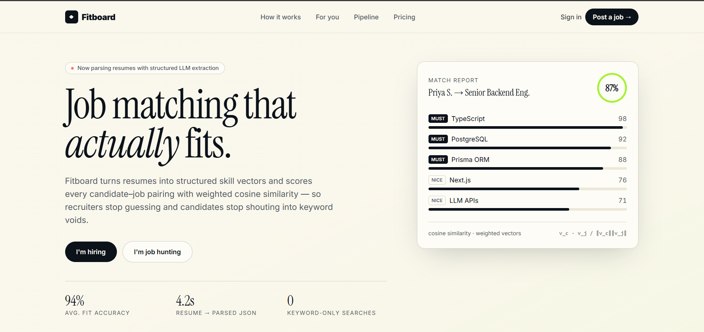

<div align="center">

# Fitboard

**Job matching that actually fits.**

Resumes become structured skill vectors. Every match is scored with weighted cosine similarity — not keywords.



</div>

<br>

## How it works

```
Upload  →  Parse  →  Vectorize  →  Rank
 PDF/DOCX   LLM extraction   Weighted skill vectors   Cosine similarity → % fit
```

No black boxes — every score breaks down into which skills matched, and how much each was weighted.

<br>

## Highlights

- **Fit scores, not filters** — candidates see a % match before applying
- **Structured parsing** — resumes → validated JSON via LLM extraction
- **Kanban pipeline** — Applied → Reviewed → Interviewed → Offered
- **Calendar-synced scheduling** + automated email notifications

<br>

## Stack

This repo is a **UI prototype** (TanStack Start · Vite · shadcn/ui), built for rapid design iteration.

The planned production stack — detailed in the project synopsis — is:

`Next.js` · `TypeScript` · `Prisma` · `Neon` · `NextAuth.js` · `Gemini API` · `Razorpay`

<br>

<div align="center">

*Week 1 of 4 — UI complete. Backend begins Week 2.*

</div>
