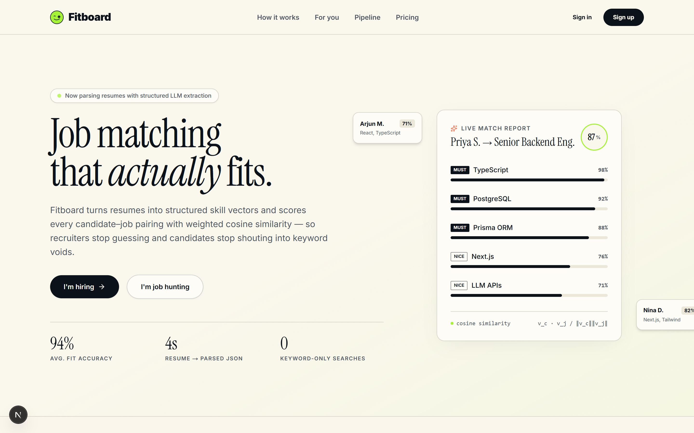

<div align="center">

# Fitboard

**Job matching that *actually* fits.**

</div>

A modern job board that replaces keyword search with weighted cosine-similarity matching. Resumes are parsed into structured skill vectors and scored against every job listing — so recruiters get ranked shortlists and candidates stop shouting into keyword voids.



---

## How it works

```
Resume PDF  →  Text Parsing  →  Skill Vector  →  Cosine Similarity Score  →  Ranked Shortlist
```

1. **Upload** — Candidate submits a PDF or DOCX resume
2. **Parse** — The resume is read and skills, experience, and history are extracted into structured JSON
3. **Vectorize** — Skills are mapped into a weighted dimensional vector
4. **Match** — Every candidate–job pair is scored with `v_c · v_j / ‖v_c‖‖v_j‖`

---

## Stack

| Layer | Tech |
|---|---|
| Framework | Next.js 16 (App Router) |
| Database | PostgreSQL + Prisma ORM |
| Auth | NextAuth.js |
| Parsing | Custom resume parser (pdf-parse, mammoth) |
| Styling | Tailwind CSS v4 |
| Animations | Framer Motion |

---

## Getting started

```bash
# Install dependencies
npm install

# Set up environment variables
cp .env.example .env.local

# Run database migrations
npx prisma migrate dev

# Start the dev server
npm run dev
```


---

## Environment variables

```env
DATABASE_URL=
NEXTAUTH_SECRET=
NEXTAUTH_URL=
GOOGLE_API_KEY=
```

---

## Features

- **Resume parsing** — PDF/DOCX → structured skill data extracted via text analysis
- **Skill-vector scoring** — Weighted cosine similarity, explainable and tunable
- **Kanban pipeline** — Applied → Reviewed → Interviewed → Offered
- **Two-sided platform** — Separate dashboards for candidates and employers
- **Match score breakdown** — Per-skill weights visible on every application

---

Built by [Abhay Dutta](https://github.com/AbhayDutta)
